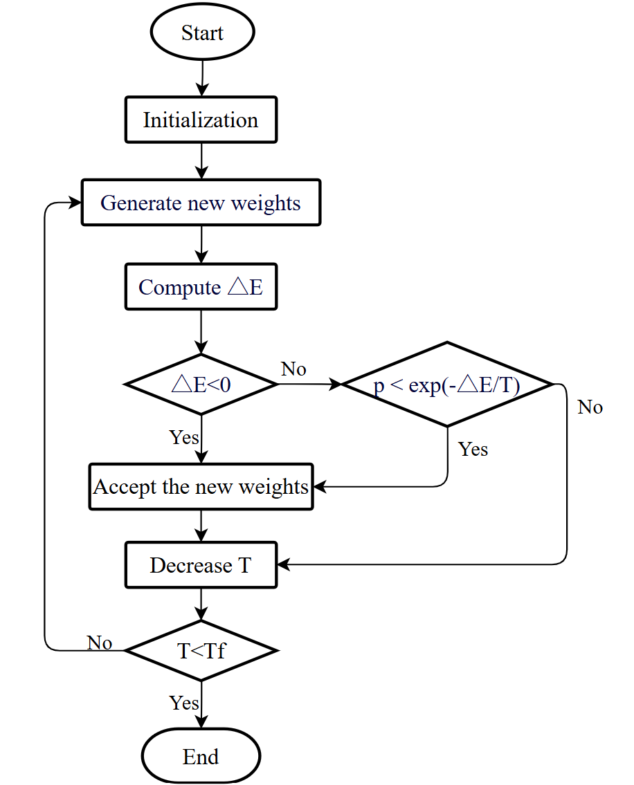
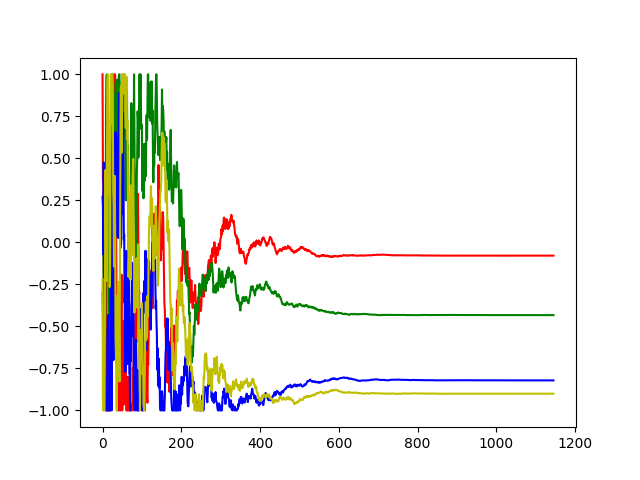
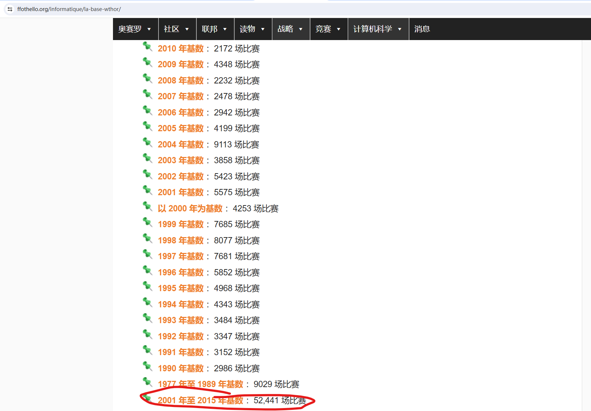
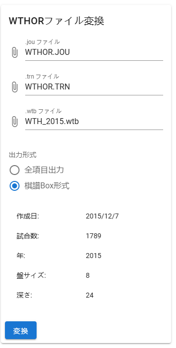
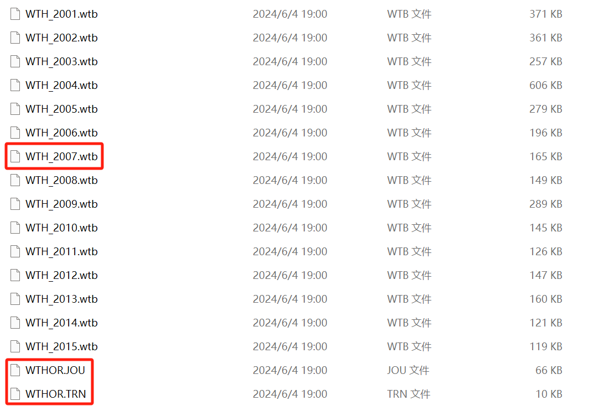
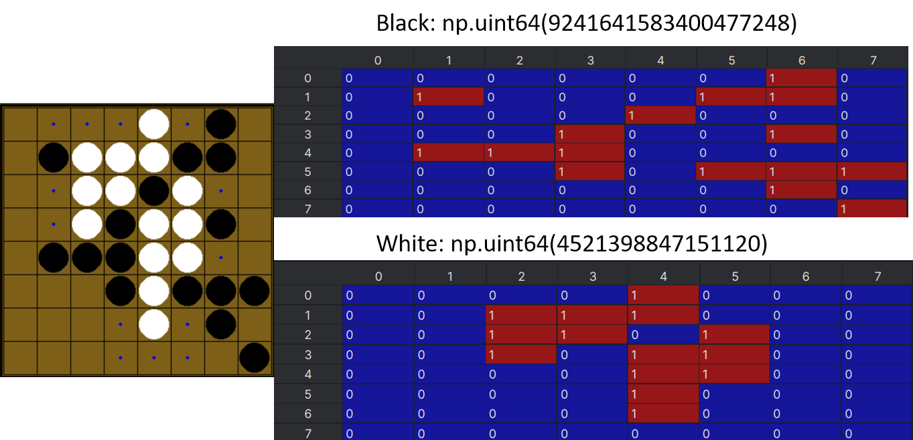
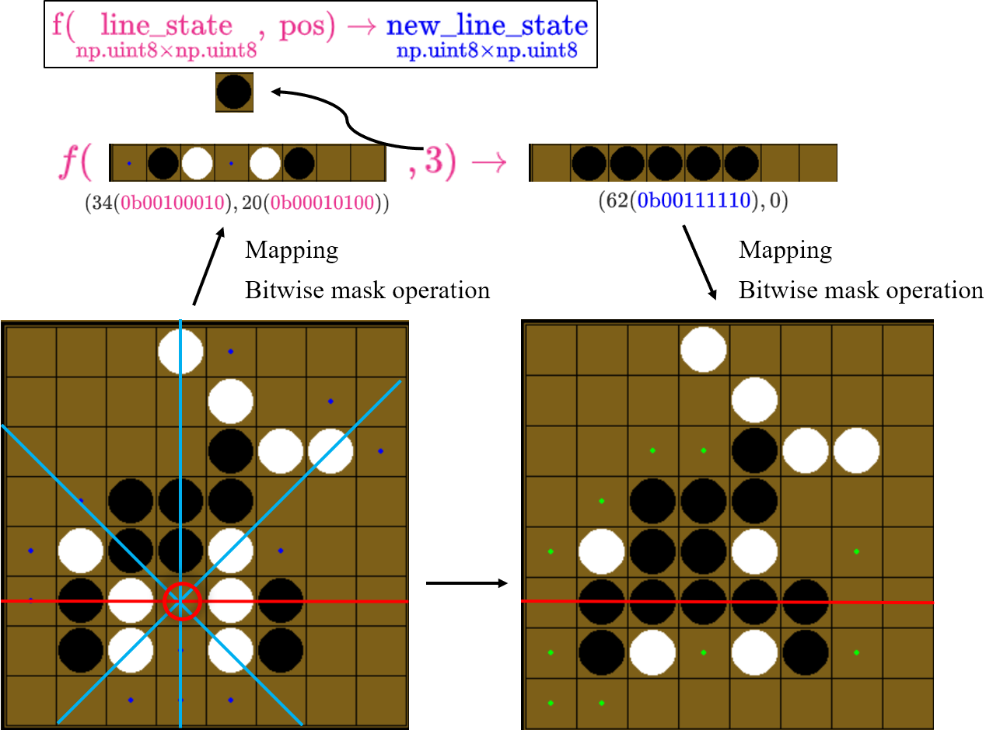
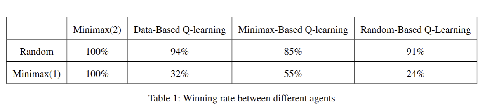
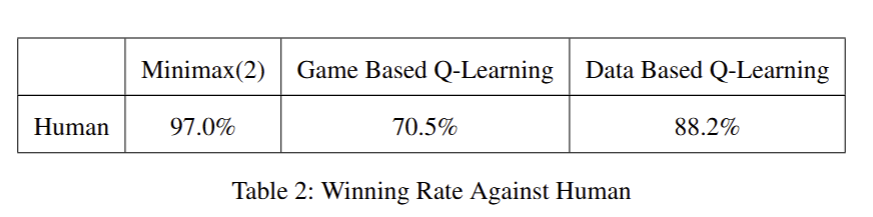

# MiGuRU: Minimax-Guided Reinforcement learning othello with User interface

### <font color="orange">Getting Started</font>

###### Introduction

Ciallo～(∠·ω< ), welcome to the world of Othello!


In this project, we develop multiple game agents for Othello, a board game with complex strategies. We perform extensive optimizations of speed and hyperparameters. Through experiments, we evaluate these agents’ performance by analyzing win rates and efficiency. Our results offer insights into each approach and suggest potential refinement for Othello.

Our paper are provided in `./paper`.


###### Environment Setup

We tested our code both on Linux and on Windows. However, if you want to visualize the game process, we strongly recommend you to use Windows to test.

All dependencies：

> numpy==2.0.0
>
> pandas==2.2.2
>
> pygame==2.5.2
>
> tqdm==4.66.4
>
> matplotlib==3.9.0

You can run the following codes in terminal.

```bash
conda create -n othello python=3.10 -y
pip install -r requirements.txt
```

### <font color="orange">Test </font>

After preparing environment, you can test our project with <font color="blue">**test.py**</font>.

Note that we have already prepared weights in `/final_weight`, but you can also train your own ones.

We have provided several functions.

- If you want to play Othello **pVp**:
  - Run `playerTest()`
- If you want to test our **data-Based Q-learning Agent** against **Random Agen**t:
  - Run `dataLearningTestRandom()`
- Other functions can be called in the same way to test.

### <font color="orange">Train your own RL Agent</font>

After preparing environment, you can train an agent with <font color="blue">**training.py**</font>.

We have provided several train functions.

- If you want to train an **Game-Based Q-learning Agent** with **Random Agent** as opponent: 
  - Run `reinforcementTraining()`, in the function please set **randomAgent** as **agentB** to be the opponent.
- If you want to train an **Game-Based Q-learning Agent** with **Minimax Agent** as opponent: 
  - Run `reinforcementTraining()`, in the function please set **MinimaxAgent** as **agentB** to be the opponent.

- <font color="green">**If you want to train on dataset!**</font>
  - Make sure that csv files have been already prepared. (We've already prepared!)
  - Run `dataTraining()`
  - Winning rate according to transcript dataset, can not be referred in training.

<font color="red">**All the logs and output for training will lie in `weight/`, if the folder doesn't exist before training, please make one.**</font>

### <font color="orange">Run SA to find better Minimax Weight</font>



```
python sa.py
```

The figure of weights changing with the iteration increasing will be saved as `sa.png`.



### <font color="orange">How to Prepare a dataset</font>

#这一段本身就是多语，那我就用中文来写吧~

数据集来源：`https://www.ffothello.org/informatique/la-base-wthor/`



- 网站是法语，开一下谷歌翻译
- 可以下载到WTHOR格式的数据集。

能够解析数据集的网站：`https://lavox.github.io/wthor.html`



做法：



1. 将`.JOU`，`.TRN`，`.wtb`文件分别放入网站文本框对应位置
2. 点击<font color="blue">**棋谱box形式**</font>选项框
3. 然后点击<font color="blue">**变换**</font>按钮，下载处理好的CSV文件。

### <font color="orange">About Optimization</font>

###### State Aggregation

We define a new board state as a tuple $\mathrm{(S_B, S_W)}$, where both $\mathrm{S_B}$ and $\mathrm{S_W}$ represent unsigned $64$-bits integers. The $64$ squares of the board are sequentially labeled from $0$ to $63$, starting from the top-left and moving to the bottom-right.
For any square $k$, if it contains a black disc, the $k$-th bit of $\mathrm{S_B}$ is set to $1$. Similarly, if a square $k$ contains a white disc, the $k$-th bit of $\mathrm{S_W}$ is set to $1$. All unset bits default to $0$.



###### Successors Generating

1. **Pre-judging legality**
2. **Status Update**
3. **Feature Extraction**

Details please according to our paper.



###### Cache

Use a $\mathrm{150k}$-entry dict to store all legal moves and resulting states.

## <font color="orange">Experiments</font>





### <font color="orange">Acknowledgements</font>

Thanks to the following work that we refer to and benefit from:

- CS181 AI course
  - Our `utils.py`, `minimaxAgent.py`, `featureExtractors.py` and `learningAgents.py` all take CS181 PA framework as reference
- CS181 AI course project comes from UC Berkeley, we keep the licenses in the above $4$ python files.

### <font color="orange">Contributors</font>

Yinuo Bai - [otanaaa](https://github.com/otanaaa)

- Game UI, Visualization, Framework.
- Minimax Agent.
- Simulated Annealing to optimize hyperparameters.
- Game-based reinforcement learning.
- Paper for above parts

Ziwei Shan - [koyui](https://github.com/koyui)

- Optimize the framework and optimize the calculation speed.
- Bitwise operation support.
- Preparing dataset, data preprocessing.
- Data-based reinforcement learning.
- Two Pres and corresponding PPT and lecture notes.
- Paper for above parts and experiments

Jiale Lin - [oierlin](https://github.com/oierlin)

- Experiments on CNN network.
